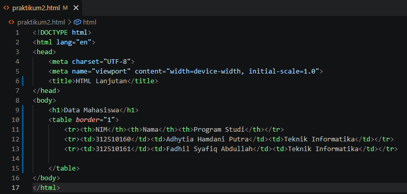
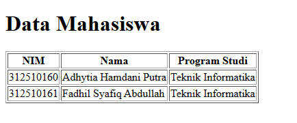

# PRAKTIKUM 2 - HTML LANJUTAN  
  
**Nama:** Fadhil Syafiq Abdullah 
**NIM:** 312510161 
**Mata Kuliah:** Pemrograman Web 
---
## Praktikum 2: HTML Lanjutan  
Praktikum ini membahas beberapa materi HTML lanjutan, yaitu tabel, form, berbagai jenis input, semantic HTML, multimedia, serta validasi form dasar. Praktikum dilakukan menggunakan HTML sebagai fokus utama. 
### Membuat Tabel Data Mahasiswa  
pada langkah pertama dibuat sebuah tabel untuk menampilkan data mahasiswa. Tabel menggunakan elemen HTML seperti `table`, `tr`, `th`, dan `td`. Data yang ditampilkan terdiri dari NIM, nama, dan program studi. 
Code:  
  
Output:  
  